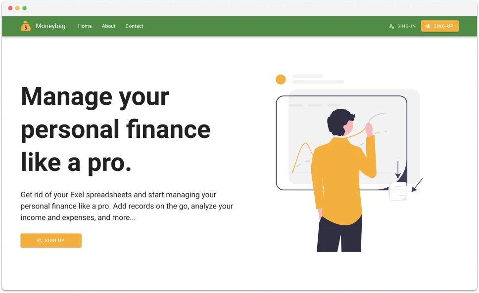
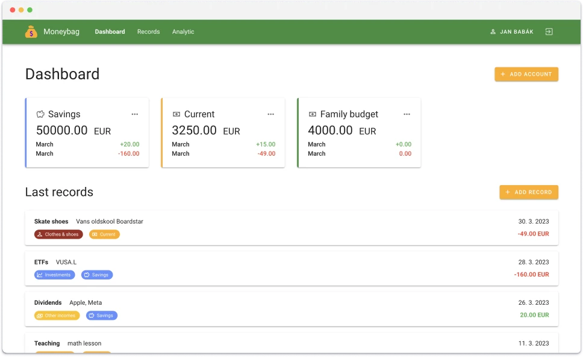
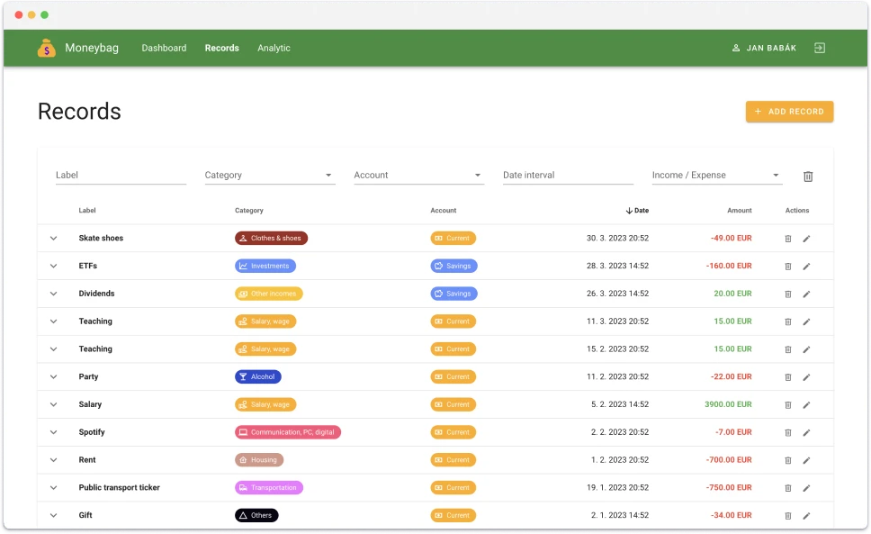
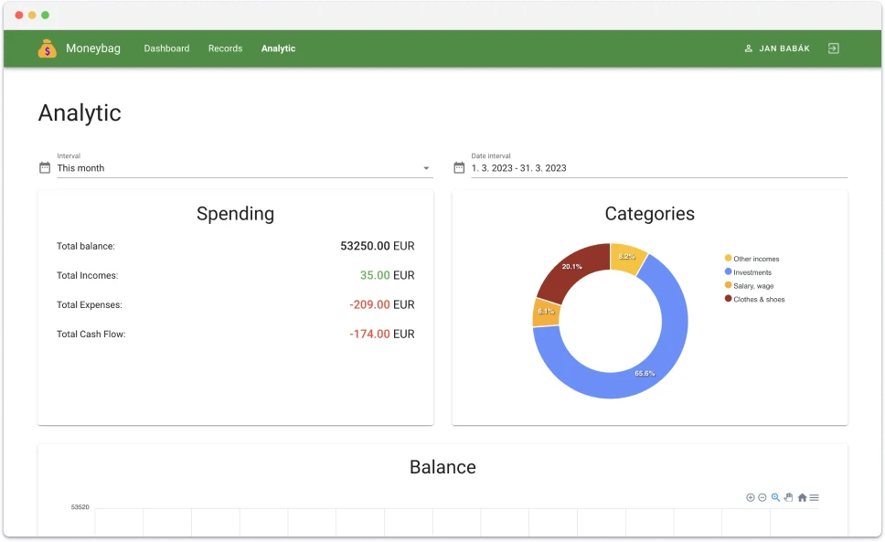
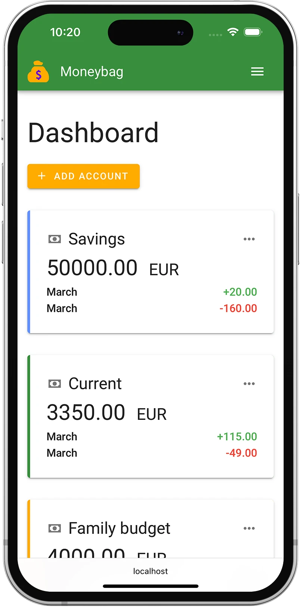
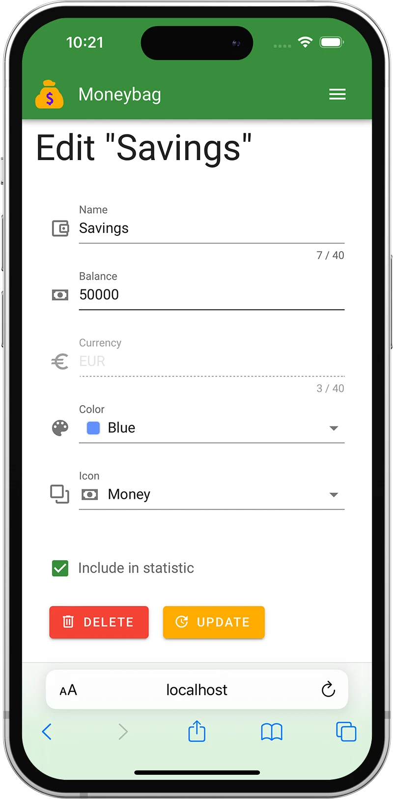
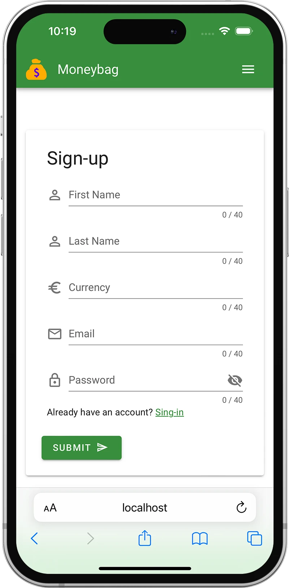
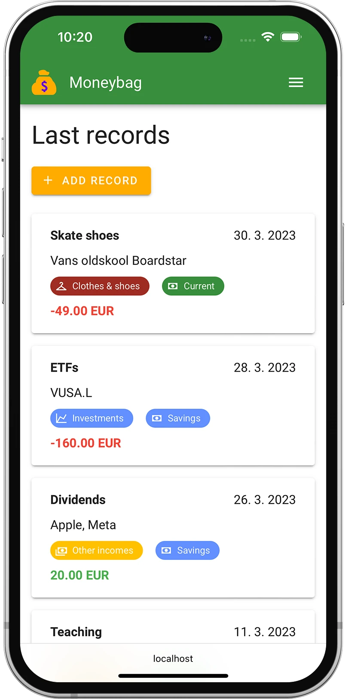

# Moneybag - Frontend

[](https://www.typescriptlang.org)
[](https://vuejs.org)
[](https://vuetifyjs.com/en/)
[](https://html.spec.whatwg.org/multipage/)
[](https://www.w3.org/Style/CSS/Overview.en.html)
[](https://www.figma.com)
[](https://www.npmjs.com)

## 📝 Description

Moneybag is a **web application** used to manage **personal finance**. Users can have several accounts. They can create and categorize their records and then analyze their income and expenses.

The application consists of a **separate backend and frontend**, which are connected via a **REST API**. The backend is written in Java using the Spring framework and uses a MySql database for data persistence. The frontend is a **single-page application** written in TypeScript and the Vue.js and Vuetify frameworks.

## 🔗 Links

- [📺 Video example](https://www.youtube.com/watch?v=rzZ-Xvy9iwY)
- [💅 Backend repo](https://github.com/janbabak/Moneybag-BE)
- [📯 API documentation (Post man)](https://documenter.getpostman.com/view/131905572s93CRKWwv#b9ffcedf-337f-4546-8095-5740e9047e96)
- [📄 API documentation (Swagger)](https://janbabak.github.io/Moneybag-BE/)

## ⚽️ Project Goals

There were several reasons why I created this project. First of all, I wanted to try different technologies. Secondly, I wanted to try all stages of a software development cycle. And I also wanted to add some work to my portfolio, which can showcase my development skills.

## 🏗️ Realization

First, I created a list of all the requirements, chose the necessary technologies, and then started developing the backend server.

I developed the front end as a SPA using the Vue.js framework using TypeScript instead of JavaScript for convenience and using the Vuetify component library. I used the Axios library for communication with the API and the Apex charts library for chart rendering. I also set up an automatic on GitHub using GitHub actions.

## 🧑‍🔬 Technologies

- [Vue.js](https://vuejs.org)
- [Vuetify](https://vuetifyjs.com/en/)
- [TypeScript](https://www.typescriptlang.org)
- [Npm](https://www.npmjs.com)
- [Node.js](https://nodejs.org/en)
- [GitHub actions](https://github.com/features/actions)
- [git](https://git-scm.com)

## ✅ Software requirements

- npm
- node

## 🎬 How to run

### Clone repository

```bash
git clone https://github.com/babakjan/Moneybag-FE.git
cd Moneybag-FE/
```

### Start backend

[Backend repository](https://github.com/babakjan/Moneybag-BE)

### Install dependencies

```bash
npm install
```

### Compiles and hot-reloads for development

```bash
npm run serve
```

### Compiles and minifies for production

```bash
npm run build
```

### Lints and fixes files

```
npm run lint
```

## 🎆 Screenshots






<p align="center">
    
    
    
    
    
</p>
