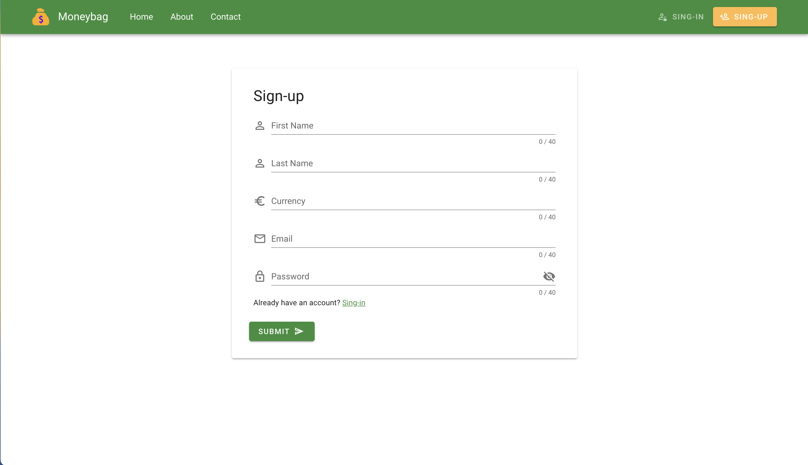
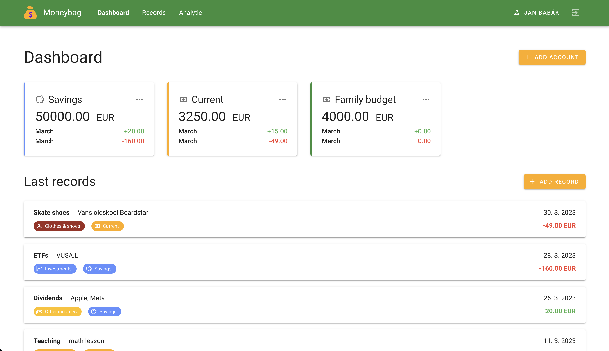
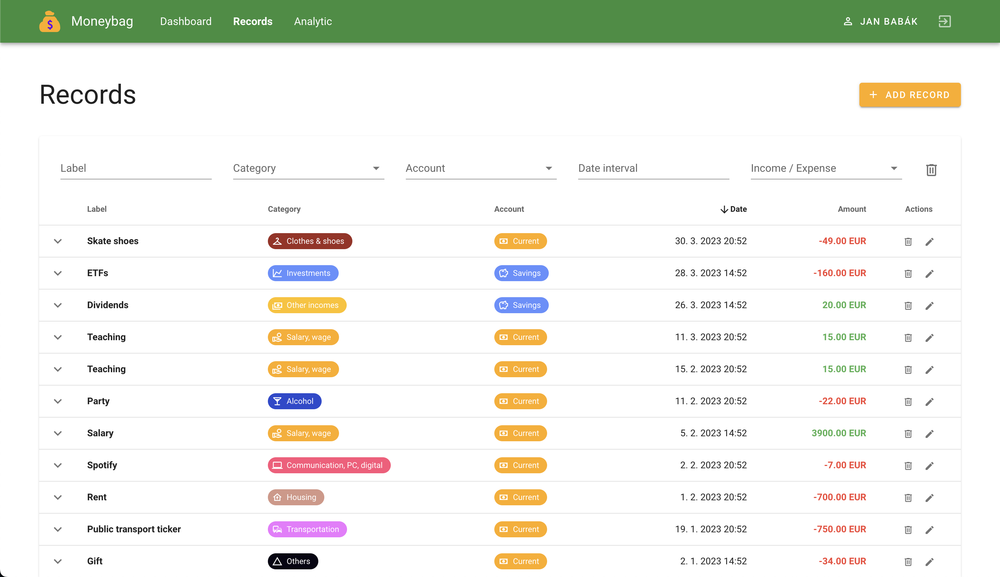
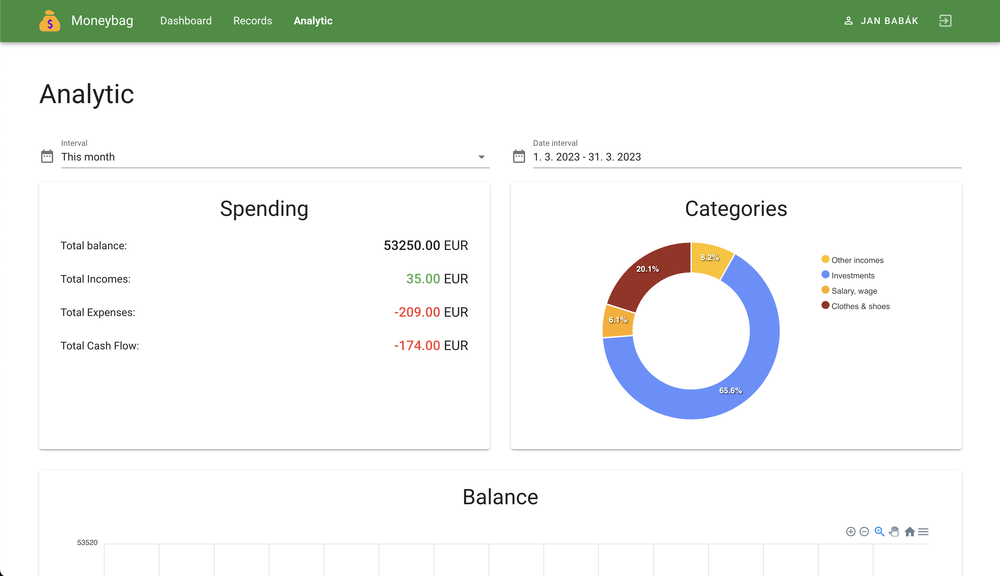

# 💰 Moneybag - Frontend

Moneybag is a web **app for personal finance management**. Get rid of your Exel
spreadsheets and start managing your personal finance like a pro. Add records
on the go, analyze your income and expenses, and more.

## 📝 Description

This repository contains source codes of the frontend of the Moneybag application. There were several reasons, why I
created this project. First of all, I wanted to try different technologies, secondly, I wanted to try all stages of a
software development cycle. And I also wanted to add some work to my portfolio, which can showcase my development
skills.

## 🚀 Features

- Multiple financial accounts
- Add records and categorize them
- Analytic of categories, incomes, expenses, cash flow...
- Charts
- Responsive web interface

## 🧑‍🔬 Technologies

- Vue.js
- Vuetify
- TypeScript
- Npm
- Node.js
- GitHub actions
- git

## 🔗 Links

- [Backend repository](https://github.com/babakjan/Moneybag-BE)
- [API documentation (Post man)](https://documenter.getpostman.com/view/13190557/2s93CRKWwv#b9ffcedf-337f-4546-8095-5740e9047e96)
- [API documentation (Swagger)](https://babakjan.github.io/Moneybag-BE/)

## ✅ Software requirements

- npm
- node

## 🎬 How to run

### Clone repository

```bash
git clone https://github.com/babakjan/Moneybag-FE.git
cd Moneybag-FE/
```

### Start backend

[Backend repository](https://github.com/babakjan/Moneybag-BE)

### Install dependencies

```bash
npm install
```

### Compiles and hot-reloads for development

```bash
npm run serve
```

### Compiles and minifies for production

```bash
npm run build
```

### Lints and fixes files

```
npm run lint
```

## 🖼️ Frontend examples






